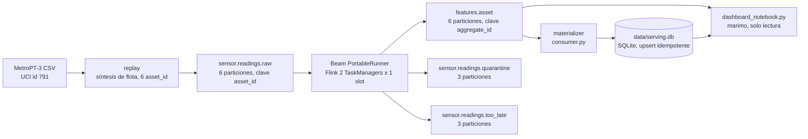

# apu-streaming · Pipeline de streaming para mantenimiento predictivo de APU

**Curso:** Streaming de datos y sus aplicaciones — Maestría en Inteligencia Artificial, FPUNA.
**Autor:** Odilón Nolf Sánchez (`onolf@outlook.com`).
**Estado:** implementado.

## 1. Problema, usuarios y decisiones que habilita

El problema es el monitoreo continuo de una flota de compresores de Unidad de Producción de Aire (APU) de motores de inducción trifásicos, con el objetivo de detectar una fuga de aire — la falla dominante reportada por el fabricante — antes de que derive en una intervención no planificada. El usuario del resultado es el equipo de mantenimiento de planta: consume el indicador `apu_health_indicator` por activo y por ventana de 5 minutos y decide si emite una orden de mantenimiento anticipada.

Este proyecto **continúa** el trabajo entregado en `../tarea1.pdf` (arquitectura Kafka para mantenimiento predictivo de motores de inducción trifásicos: tópicos en capas, clave `asset_id` justificada por las garantías de orden de Kafka) y en `../tarea2.pdf` (política temporal completa: ventana fija de 5 min en tiempo de evento, watermark heurístico con margen de 2 min, panes earlvy/on-time/late, `allowed lateness` de 10 min, modo `ACCUMULATING`, upsert por `(asset_id, window_start)`). Aquella arquitectura era un diseño en papel sobre un caso hipotético; este proyecto la **implementa y ejecuta** sobre datos reales de un compresor de tren (MetroPT-3, UCI id 791), con una flota sintetizada a partir de tramos temporales reales.

## 2. Diagrama de arquitectura



Componentes: (A) fuente histórica acotada y con licencia CC BY 4.0; (B) productor de replay que desplaza el tiempo de evento a una línea temporal reciente y simula duplicados, desorden y retrasos; (C) log Kafka particionado por `asset_id`; (D) pipeline Apache Beam ejecutado con `PortableRunner` sobre un clúster Flink local, con validación, deduplicación con estado, ventanas de tiempo de evento y dos agregaciones incrementales; (E)-(G) tres tópicos de salida: el derivado y dos laterales de auditoría; (H) proceso propio que materializa el tópico derivado en un sink idempotente durable; (J) tablero de solo lectura.

## 3. Contrato de evento de entrada

Cada evento representa **una lectura de un stream de un activo**, no una fila completa del sensor. Ejemplo real (activo con falla, `apu-04`, stream `motor_current`):

```json
{
  "schema_version": 1,
  "event_id": "apu-04|motor_current|2020-04-18T08:00:00Z",
  "asset_id": "apu-04",
  "asset_type": "apu_compresor_motor_trifasico",
  "sensor": {"stream": "motor_current", "channel": "Motor_current", "unit": "A"},
  "value": 5.66,
  "event_time": "2026-09-16T07:05:00Z",
  "ingestion_time": "2026-09-16T11:05:00Z",
  "source_event_time": "2020-04-18T08:00:00Z"
}
```

Campos:

| Campo | Rol |
|---|---|
| `schema_version` | entero `1` o `2`; ver política de versionado abajo |
| `event_id` | `f"{asset_id}|{stream}|{source_event_time}"`; estable entre corridas y entre reintentos porque se construye sobre el timestamp **original** del dataset, no sobre el desplazado por el replay. Un evento republicado como duplicado conserva el mismo `event_id`. |
| `asset_id` | clave de negocio y de partición; ver sección 4 |
| `asset_type` | constante `"apu_compresor_motor_trifasico"` |
| `sensor.stream` | nombre lógico normalizado (`motor_current`, `oil_temperature`, …) |
| `sensor.channel` | identificador **exacto** de la columna de origen en MetroPT-3 (`Motor_current`, `Oil_temperature`, `TP2`, `TP3`, `H1`, `DV_pressure`, `Reservoirs`); no se normaliza ni se corrige, incluso donde la fuente tiene una inconsistencia de nomenclatura (p. ej. `DV_eletric`, no usado en v1/v2 pero presente en la fuente cruda) |
| `sensor.unit` | `"A"`, `"degC"` o `"bar"` |
| `value` | lectura numérica finita |
| `event_time` | tiempo de evento del dominio, ya desplazado a la línea temporal de la demo; es el timestamp que Beam usa para ventanas |
| `ingestion_time` | momento en que el productor publicó el evento en Kafka; usado solo para medir `event_lag` |
| `source_event_time` | timestamp original de MetroPT-3, preservado para trazabilidad y para la estabilidad de `event_id` |

**Versionado de esquema**: `schema_version = 1` cubre los 4 streams críticos de la falla objetivo (`motor_current`, `oil_temperature`, `tp2_pressure`, `dv_pressure`). `schema_version = 2` añade 3 streams de contexto (`tp3_pressure`, `h1_pressure`, `reservoirs_pressure`) sin romper compatibilidad: un consumidor v1 ignora los eventos de streams que no reconoce porque cada evento es autocontenido y filtrable por `sensor.stream`. Un `schema_version` fuera de `{1, 2}` se rechaza con el motivo `"unsupported_schema_version"`; un campo desconocido dentro de un evento válido se ignora (compatibilidad hacia adelante).

**Reglas de rechazo** (`decode_event` en `src/apu_streaming/contracts.py`): cada motivo es estable y machine-checkable; los eventos rechazados se enrutan al tópico `sensor.readings.quarantine` con el motivo adjunto.

| Motivo | Condición |
|---|---|
| `invalid_json` | el payload no es JSON parseable, o no es un objeto JSON |
| `missing_field` | falta alguno de `REQUIRED_FIELDS` (`schema_version`, `event_id`, `asset_id`, `sensor`, `value`, `event_time`, `ingestion_time`) |
| `unsupported_schema_version` | `schema_version` no es un entero en `1..SCHEMA_VERSION_MAX` |
| `unknown_stream` | `sensor.stream` no está en `STREAM_SPECS` |
| `non_finite_value` | `value` no es un número finito |
| `invalid_timestamp` | `event_time` o `ingestion_time` no son ISO-8601 parseables |
| `future_event_time` | `event_time > ingestion_time` (regla de tarea2: reloj de campo adelantado) |
| `stale_event_time` | `ingestion_time - event_time > stale_event_seconds` (86400 s, regla de tarea2) |


## 4. Tópicos, claves, particiones y orden

| Tópico | Capa | Clave de mensaje | Particiones | Retención |
|---|---|---|---|---|
| `sensor.readings.raw` | cruda | `asset_id` | 6 | por defecto de Kafka (proyecto de demostración; en producción ≥ 30 días, ver tarea1) |
| `features.asset` | derivada, con estado | `aggregate_id` | 6 | por defecto |
| `sensor.readings.quarantine` | DLQ (contrato) | `asset_id` o `b""` si no decodifica | 3 | por defecto |
| `sensor.readings.too_late` | DLQ (horizonte temporal) | `asset_id` | 3 | por defecto |

**Justificación de `asset_id` como clave de partición de entrada** (heredada y confirmada de `../tarea1.pdf`): Kafka garantiza orden total dentro de una partición y ninguna garantía entre particiones. La deduplicación con estado y la ventana por activo exigen ver todos los eventos de un mismo `asset_id` en orden relativo; si se particionara por `sensor.stream` o por una clave aleatoria, los eventos de un mismo activo se dispersarían entre particiones y el estado de deduplicación quedaría fragmentado o el balanceo de carga rompería la localidad necesaria para las ventanas por activo. Alternativas descartadas: `sensor.stream` (fragmenta el estado por activo entre streams); clave aleatoria (pierde el orden relativo por activo).

**Reconciliación explícita con `../tarea1.pdf`**, para que esta arquitectura documentada no contradiga la implementación:

- (a) `features.asset` conserva el nombre y la capa "con estado" de tarea1, pero su clave de **mensaje** Kafka es `aggregate_id` — un superconjunto de `asset_id` que incorpora `metric_type`, `stream` (cuando aplica) y `window_start`, porque ésa es la clave de idempotencia del pane, no la clave de partición de entrada.
- (b) la capa `anomaly.predictions` de tarea1 **no se implementa** en este proyecto; corresponde a una extensión de scoring de modelos (fuera de alcance, ver Context del plan).

**Particiones, paralelismo y skew**: 6 particiones en los tópicos de activo, aproximadamente una por `asset_id` sintetizado, siguiendo la misma regla de tarea1 (particiones ≈ cantidad de activos monitoreados) para evitar que un activo ruidoso sature una partición compartida. El paralelismo del job Beam es 2 (`BEAM_PARALLELISM`), con 2 TaskManagers de 1 slot cada uno: cada subtarea atiende 3 particiones. El skew es real y medido, no simulado: el tramo de `apu-06` tiene un hueco de 139 s (verificado sobre el CSV de origen) frente a los 10 s de cadencia normal del resto de los tramos, producto de una discontinuidad real del registro durante la falla #4. Ese hueco deja la partición de `apu-06` momentáneamente ociosa; cuando una partición está ociosa más de un umbral, KafkaIO deja de usarla para frenar el avance del watermark global, así que el resto de las particiones sigue progresando sin esperar a la más lenta.

## 5. Esquema de salida

Dos `metric_type` conviven en `features.asset`:

**`apu_signal_stats`** — estadística incremental de un stream de un activo en una ventana:

```json
{
  "schema_version": 1,
  "aggregate_id": "apu_signal_stats|apu-04|motor_current|2026-09-16T07:05:00Z",
  "metric_type": "apu_signal_stats",
  "asset_id": "apu-04", "stream": "motor_current", "unit": "A",
  "window_start": "2026-09-16T07:05:00Z", "window_end": "2026-09-16T07:10:00Z",
  "readings": 30, "value_mean": 5.66, "value_min": 5.40, "value_max": 5.91, "value_stddev": 0.12,
  "pane_index": 0, "pane_timing": "UNKNOWN", "is_first": true, "is_last": false,
  "emitted_at": "2026-09-16T07:05:10Z",
  "accumulation": "ACCUMULATING",
  "corrections_close_at": "2026-09-16T07:22:00Z"
}
```

**`apu_health_indicator`** — indicador de salud del activo completo en una ventana:

```json
{
  "schema_version": 1,
  "aggregate_id": "apu_health_indicator|apu-04|2026-09-16T07:05:00Z",
  "metric_type": "apu_health_indicator",
  "asset_id": "apu-04",
  "window_start": "2026-09-16T07:05:00Z", "window_end": "2026-09-16T07:10:00Z",
  "motor_readings": 30, "running_ratio": 1.0, "oil_temperature_mean": 75.0, "air_leak_suspected": true,
  "pane_index": 3, "pane_timing": "ON_TIME", "is_first": false, "is_last": true,
  "emitted_at": "2026-09-16T07:10:02Z",
  "accumulation": "ACCUMULATING",
  "corrections_close_at": "2026-09-16T07:22:00Z"
}
```

`aggregate_id` es la clave de idempotencia y de upsert en el sink; ambos `metric_type` la construyen concatenando el tipo de métrica, la dimensión (`asset_id[|stream]`) y `window_start`.

## 6. Política temporal

- **Ventana**: fija de 300 s (5 min), sobre `event_time` del contrato — no sobre `ingestion_time` ni sobre el tiempo de procesamiento.
- **Trigger**: `AfterWatermark(early=AfterProcessingTime(10), late=AfterCount(1))` — un pane especulativo cada 10 s de tiempo de procesamiento, uno on-time cuando el watermark cruza el fin de la ventana, y uno por cada evento tardío aceptado.
- **Modo de acumulación**: `ACCUMULATING` — cada pane contiene el total conocido hasta ese momento, no un delta; esto es coherente con `CombinePerKey` y permite que el sink reemplace la fila completa en cada upsert.
- **Allowed lateness**: 720 s (12 min).

**Hallazgo que fija estos valores y limita lo que tarea2 proponía**: `ReadFromKafka(timestamp_policy=ReadFromKafka.create_time_policy)` se traduce en el lado Java a `TimestampPolicyFactory.withCreateTime(Duration.ZERO)` — verificado leyendo `KafkaIO.java:883` de `apache/beam` en la etiqueta `v2.74.0`. Con `maxDelay = 0` el watermark de cada partición es `Min(now(), Max(event_time observado)) - 0`. Cuatro consecuencias:

1. **El margen de watermark de 2 min de tarea2 no es expresable** desde `ReadFromKafka` en Python: no existe un parámetro equivalente a `withCreateTime(Duration)` en la API expuesta. Se absorbe en el horizonte de corrección: `allowed_lateness = 720 s = 120 s (margen de tarea2) + 600 s (lateness de tarea2)`, preservando los 12 minutos totales de corrección que tarea2 declaraba entre margen y lateness.
2. Con `maxDelay = 0`, todo evento cuyo `event_time` sea menor al máximo observado en su partición es, en sentido estricto, tardío respecto del watermark de Kafka. El caso "desordenado pero a tiempo" de tarea2 (evento E4, que llega fuera de orden pero antes de que el watermark cruce el fin de su ventana) **no es demostrable sobre el pipeline conectado a Kafka** con esta política; se demuestra en `tests/test_windows_teststream.py` con `TestStream`, donde el watermark se controla explícitamente y puede quedar por debajo del `event_time` máximo observado.
3. El watermark de KafkaIO está topado en `now()`. Si el replay desplazara el tiempo de evento hacia el futuro, el watermark quedaría anclado al reloj de pared y una ventana de 5 minutos tardaría 5 minutos reales en cerrar, anulando la aceleración del replay. Por eso el productor ancla el final de la línea de tiempo desplazada en `now()` (`target_start = now - duración_del_tramo`), garantizando `max(event_time) ≤ now` en todo momento.
4. Al terminar el replay todas las particiones quedan sin tráfico; cuando KafkaIO las marca ociosas su watermark salta a `now()`, lo que dispara los panes finales de las últimas ventanas. Ese es el cierre natural de la demostración.

**Sustituciones respecto de los nombres de campo de tarea2**: `watermark_at_emit` se sustituye por `emitted_at` (tiempo de procesamiento en el momento de formatear el agregado), porque Beam Python no expone el valor del watermark dentro de un `DoFn`. `is_final` se sustituye por `is_last` (`pane_info.is_last`), el campo nativo de Beam con el mismo significado: el runner no volverá a disparar un pane para esa ventana.

## 7. Duplicados, idempotencia y semántica de entrega

**Deduplicación**: por `event_id`, con estado (`SetStateSpec`) particionado por `(asset_id, ventana)` — el estado vive dentro de un `DoFn` aplicado después de asignar la ventana y agrupar por `asset_id`, así que dos activos nunca comparten estado de deduplicación. El horizonte de retención del estado es `window.end + allowed_lateness_seconds` (un `TimerSpec` de dominio `WATERMARK` fijado a ese instante limpia el conjunto de IDs vistos); un `event_id` que reaparece después de ese horizonte se trata como nuevo, lo cual es aceptable porque para entonces la ventana correspondiente ya cerró y cualquier pane adicional sería ignorado por el sink de todas formas.

**Idempotencia en la salida**: clave de upsert `aggregate_id`. La regla de aplicación es "aplicar solo si `pane_index` del pane entrante es mayor o igual al `pane_index` ya almacenado" — implementada como una cláusula `WHERE` en el `UPSERT` de SQLite (ver `src/apu_streaming/serving.py`). Esto hace el sink **monótono**: reaplicar el mismo pane no altera la fila, y un pane viejo reentregado (por ejemplo, tras un reinicio del consumidor con `auto.offset.reset=earliest`) no retrocede un valor ya corregido.

**Semántica de entrega alcanzada, tramo por tramo** — declarada explícitamente para no sobreprometer:

- **Productor → Kafka**: productor idempotente (`enable.idempotence=true`, `acks=all`), lo que evita duplicados **de red** dentro de una sesión del productor, pero no es transaccional; el productor de este proyecto además inyecta duplicados **lógicos** a propósito (mismo `event_id`, dos publicaciones) para ejercitar la deduplicación aguas abajo.
- **Kafka → Beam**: `enable.auto.commit=true` en el consumidor de KafkaIO — semántica *at-least-once*: un reinicio del job puede reprocesar registros ya leídos. Los checkpoints de Flink acotan cuánto se reprocesa, pero no eliminan la posibilidad.
- **Beam → sink**: la deduplicación por `event_id` dentro del horizonte de lateness, más el upsert idempotente por `aggregate_id`, convierten los duplicados y las reentregas en un resultado final estable — pero solo dentro de la ventana de vida del estado (`allowed_lateness`), no indefinidamente.

**Declaración explícita**: este sistema **no ofrece exactly-once end-to-end**. Ofrece at-least-once en cada tramo de transporte, con idempotencia acotada temporalmente en el procesamiento (deduplicación con horizonte) y en la salida (upsert monótono por clave). Afirmar exactly-once end-to-end requeriría transacciones de Kafka de extremo a extremo y una semántica de sink transaccional, ninguna de las cuales está implementada aquí.

## 8. Límites conocidos y supuestos

- La flota de 6 `asset_id` es una **síntesis** sobre un único APU real; no son 6 activos físicos distintos. Esto se declara en el README y en `data/sample/ATRIBUCION.md`.
- El watermark de `ReadFromKafka` tiene `maxDelay = 0` (ver sección 6); el margen de tolerancia al desorden vive enteramente en `allowed_lateness`, no en un margen de watermark independiente.
- El clúster es de un solo broker Kafka y un solo `JobManager` de Flink, sin replicación ni alta disponibilidad: es un laboratorio reproducible en una máquina de desarrollo, no un despliegue de producción.
- `enable.auto.commit=true` en el consumidor de KafkaIO: los offsets se confirman automáticamente, lo cual es *at-least-once*, no *exactly-once*.
- El replay acelera el tiempo de evento (`--speedup`); la velocidad de reproducción es un parámetro de la demostración, no una propiedad del dominio.

## 9. Restricciones

- `asset_id` es la clave de partición de los tópicos de entrada; ningún componente puede leer o escribir eventos de un activo asumiendo una partición fija sin pasar por esa clave.
- `event_id` se calcula exclusivamente a partir de `(asset_id, stream, source_event_time)`; nunca a partir de `event_time` desplazado ni de `ingestion_time`.
- La ventana de agregación usa `event_time`; ningún combinador o `DoFn` de agregación puede usar `ingestion_time` para agrupar.
- `allowed_lateness_seconds = 720` es el único horizonte de corrección; no existe un segundo margen de watermark independiente (ver hallazgo de la sección 6).
- El estado de deduplicación expira a `window.end + allowed_lateness_seconds`, nunca antes.
- La aplicación de un agregado en el sink exige `pane_index` entrante `≥` `pane_index` almacenado; ninguna ruta de escritura puede saltarse esa comparación.
- Los tres tópicos de salida (`features.asset`, `sensor.readings.quarantine`, `sensor.readings.too_late`) se escriben siempre desde el pipeline; ninguno queda como salida lateral sin consumir.
- El sistema nunca afirma *exactly-once end-to-end*; toda declaración de semántica de entrega debe acotarse por tramo (productor→Kafka, Kafka→Beam, Beam→sink), como en la sección 7.
- `sensor.channel` conserva el identificador exacto de la columna de origen de MetroPT-3, incluidas sus inconsistencias de nomenclatura; ningún componente normaliza ese valor.

## 10. Integrantes y contribuciones

Equipo individual: **Odilón Nolf Sánchez** (`onolf@outlook.com`) — diseño de arquitectura y contrato de eventos (continuación de tarea1/tarea2), síntesis de flota y calibración de umbrales de dominio sobre MetroPT-3, implementación completa del productor de replay, el pipeline Beam, el sink idempotente, las pruebas (incluida la prueba temporal con `TestStream`), el smoke test end-to-end y la documentación.
